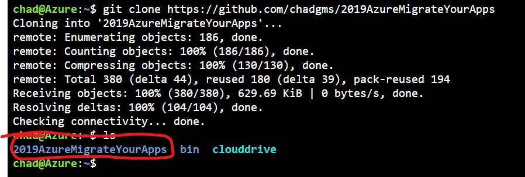
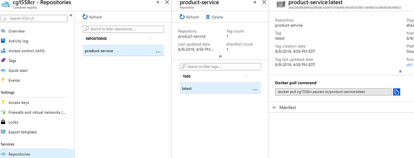
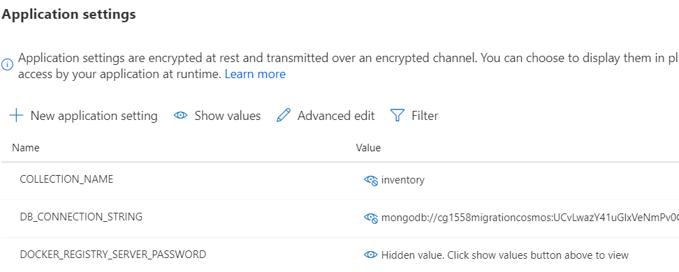

# Lab2 - Containerizing  applications on Azure

## Lab Goals

The goal of this lab is to take an existing web application and move it from a standard deployment using on premises web farms to a container infrastructure on Azure.  This will enable a much more saleable environment with a lot less management.   In this lab you will:

- Create a container registry in Azure
- Build an application for containers leveraging Azure compute
- Deploy the containers to scalable web instances.


## Setup Environment 

You will need a few things in your environment setup for this lab.

- Source code for the Inventory and Product services.  
- Source code for the front end web site.
- Azure Container Repository


### Setup 1 - Pull down the source code

The source code for all three projects are in this repo.  We will first pull it all down locally in our Azure Bash Shell.

1. Launch a new Azure Command Shell.  You can either:

   1. Press the shell icon in the Azure Portal, as in the setup for the Cosmos DB
   2. Open a new browser tab to:  http://shell.azure.com for a full screen experience

2. Pull down the source code locally.  Run the following git command 

   ```bash
   git clone https://github.com/chadgms/2019AzureMigrateYourApps
   ```

3. If you do an ls command you should see the repo on your local shell
   


### Setup 2 - Create an Azure Container Registry

1. In the Azure portal click on the new resource button
2. Type 'Container Registry' in the search bar - press enter
3. Select Create
4. Fill in properties
   1. Registry name: (prefix)acr
   2. Location: default
   3. Admin User: Enable
   4. SKU: Standard
5. Creation should only take a few minutes, but you can review key features while you are waiting here: https://docs.microsoft.com/en-us/azure/container-registry/container-registry-intro


## Activity 1 - Build your services for docker containers

Now we get into the really exciting stuff!  We have an existing code base for our two services and web front end.  These steps will compile the code, put them in a docker container and put the container image into the container registry.  Typically you would need Docker installed and configured.  Azure Container Registry Service can do the build and containerization for us all on the cloud!  We just need to point it to our source code.

### Build the code and deploy to ACR

1. Set an environment variable to the name of your Azure Container Registry (ACR).  It is the name you put in the Registry Name property when you created the registry -  (prfex)cr.   (Do NOT use the full .azurecr.io UNC, only the name)

   ```bash
   MYACR=<your ACR name>
   ```

   

2. Run the following command to build the code and push the product service image to the ACR.

   ```bash
   az acr build -t product-service:latest -r $MYACR ./2019AzureMigrateYourApps/Lab2-ContainerizingApplications/src/product-service
   ```

3. When finished you can confirm that the container was deployed to ACR in the portal.

   1. Click on your resource groups in the portal left navigation bar
   2. Click on your resource group
   3. Locate your ACR resource type 'Container Register' - Click it
   4. Click 'Repositories' in the left navigation
   5. You should see your product-service in the repositories list 

4. Same for the inventory service.

   ```
   az acr build -t inventory-service:latest -r $MYACR ./2019AzureMigrateYourApps/Lab2-ContainerizingApplications/src/inventory-service/InventoryService.Api
   ```

5. Verify it exists in the ACR same as before

6. Now the front end web site.

   1. Before we build the site we need to make sure that execute permission is set on the Docker configuration file:

      ```bash
      chmod +x ./2019AzureMigrateYourApps/Lab2-ContainerizingApplications/src/frontend/docker-startup.sh
      ```

   2. Now we build the code 

      ```
      az acr build -t frontend-service:latest -r $MYACR ./2019AzureMigrateYourApps/Lab2-ContainerizingApplications/src/frontend
      ```

      

7. Verify it exists in the ACR same as before


### Create Web Apps

Now that we have compiled code in containers stored in the registry we now need to deploy them to a compute platform.  In this lab we are going to use Azure Web App for Containers, but there are many ways to run containers in Azure.  Your instructor should have explored other options.  See reference links below for more information.

#### Product Service App

1. Press the create resource button in the Azure portal
2. Search for 'Web app for containers' and press enter
3. Press Create
4. Fill out parameters as follows
   1. App Name: (prefix)product
   2. Resource Group: (your resource group)
   3. OS: Linux
   4. Service Plan: Create New
      1. App Service Plan: (prefix)serviceplan
      2. Location: eastus2
      3. Pricing: Dev/Test - B1
   5. Configure Container:
      1. Pick Azure Container Registry
      2. Pick your ACR
      3. Select the product-service image
      4. latest tag
      5. Press Apply
   6. Press Create

#### Inventory Service App

1. Press the create resource button in the Azure portal
2. Search for 'Web app for containers' and press enter
3. Press Create
4. Fill out parameters as follows
   1. App Name: (prefix)inventory
   2. Resource Group: (your resource group)
   3. OS: Linux
   4. Service Plan: Pick the same plan you created for the product service app.  You only need to create one plan that the web apps share.
   5. Configure Container:
      1. Pick Azure Container Registry
      2. Pick your ACR
      3. Select the inventory-service image
      4. latest tag
      5. Press Apply
   6. Press Create

#### Front End App

1. Press the create resource button in the Azure portal
2. Search for 'Web app for containers' and press enter
3. Press Create
4. Fill out parameters as follows
   1. App Name: (prefix)frontend
   2. Resource Group: (your resource group)
   3. OS: Linux
   4. Service Plan: Pick the same plan you created for the service app.  You only need to create one plan that the web apps share.
   5. Configure Container:
      1. Pick Azure Container Registry
      2. Pick your ACR
      3. Select the frontend-service image
      4. latest tag
      5. Press Apply
   6. Press Create


### Service Configuration 

We now have web apps created for all our resources.  The last thing we need to do is configure application environment variables like connections strings.  When the services start up they can read the environment variables so we can make configurations at runtime.  

#### Product Service

The product service uses the NOSQL data that was in the on-premise MogoDB.  We successfully migrated that data to Cosmos DB, so that is what we will configure our Product Service for.

##### Get the Cosmos DB connection string

1. Click on resource groups-> (your resource group)

2. Click on your Cosmos DB Account

3. Click on the Connection String option in the left toolbar

4. Copy the Primary Connection String (NOT the primary password)

##### Set the Web App Properties

1. Click on resource groups -> (your resource group)

2. Click on your product service resource of type 'App Service'

3. Click Configuration on the left nav bar

4. Here you will see some default application setting.  We will add a few more.

5. Click + New application setting to add each of these NAME/VALUE pairs
   1. **Name**: COLLECTION_NAME   **Value**: inventory
   
   2. **Name**: DB_CONNECTION_STRING  **Value**:  (paste in the Cosmos DB connection String)
   
      1. **IMPORTANT:** We need to add the database name 'tailwind' to the connection string.  You will see the server address:port and the the /?ssl flag like this: 
   
         ```
         ...azure.com:10255/?ssl...
         ```
   
         You add the tailwind database name between them like this: 
   
         ```
         ..azure.com:10255/tailwind?ssl...
         ```
         
         
   
6. You should have two app settings something like this 

7. Press Save

#### Inventory Service

The inventory service needs to be pointed to the SQL Database that now lives in Azure SQL Azure

##### Get the Azure SQL Connection String

1. Click on resource groups -> (your resource group)
2. Click on the tailwind database (resource type: SQL database)
3. Click on connection strings on the left navigation pane
4. Copy the ADO.NET connection string

##### Set the Web App Properties

1. Click on resource groups -> (your resource group)
2. Click on your inventory service resource of type 'App Service'
3. Click Configuration on the left nav bar
4. Here we will add a Connection String 
5. Click + New connection string 
   1. Name: 'InventoryContext'
   2. Value:  (paste in the SQL connection String>)
   3. Update the SQL Connection string:
      1. User ID='migrateadmin'
      2. Password='AzureMigrateTraining2019#' 
   4. Type: SQLAzure
6. Press OK
7. Press Save


#### Front End Web Site

The last thing we need to do is to tell our front end web site the URL's to our web services for product and inventory.  

##### Get base URL's

You can get the base URL's for inventory and product services by clicking on their overview page and looking at the URL property on the right hand side.

1. Click on resource groups -> (your resource group)
2. Click on your inventory or product service resource of type 'App Service'
3. Take note / copy the URL 

##### Set Front End Web App Properties

1. Click on resource groups -> (your resource group)
2. Click on your front end resource of type 'App Service'
3. Click Configuration on the left nav bar
4. Click + New application setting to add each of these NAME/VALUE pairs
   1. Name: INVENTORY_SERVICE_BASE_URL   Value: (your inventory base url)
   2. Name: PRODUCT_SERVICE_BASE_URL   Value:  (your product service base url)
5. Press Save


#### Run the App!

That is is it!  We are done migrating the data and deploying a modern application through containers.  The last thing to do is to run the app and make sure it works!

1. Click on resource groups -> (your resource group)
2. Click on your front end service resource of type 'App Service'
3. Click on the URL in the right properties pane


***Your web app should now be live!  Congratulations!***


## Learn More/Resources

- 
